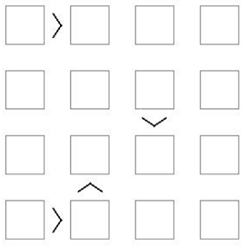
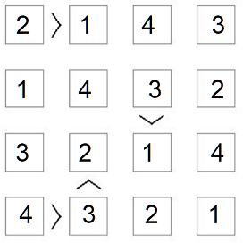

# Modified Sudoku Validator 
Modified Sudoku Validator is a Scala based solution for validating a board game similar to Sudoku.

The game has an N x N board having numbers between 1 and N. Like Sudoku, each
number can appear only once in each row and each column. But unlike Sudoku some
adjacent cells may have additional constraints between them.

## Example
Sample Board with constraints




One Valid Solution



## Installation and Pre-requisites
* Requires JDK (version 1.8 or higher). [install JDK](https://www.oracle.com/java/technologies/javase/javase-jdk8-downloads.html)
* Requires Scala and Sbt Plugins installed in IntelliJ.
Refer [link1](https://docs.scala-lang.org/getting-started/intellij-track/building-a-scala-project-with-intellij-and-sbt.html) 
and [link2](https://www.jetbrains.com/help/idea/sbt-support.html). 

## Assumptions/Pre-conditions
Board is an NxN matrix.

1 <= Board( i )( j ) <= N

0 <= i,j < N 

## Usage
**InputBoardWithConstraints class**: Contains getPuzzle method that prepares and returns a GameBoard class object
**GameValidator class**: Validates the GameBoard object 
**GameBoard class**: Models an NxN board and its constraints
**Output**: Prints 'true' if solution is valid else 'false'

```scala
/* Solution.scala */

package gameMain

/**
 * Entry point for the Game App
 * Prints true if the board is a valid board and satisfies all constraints else false
 */
object Solution extends App {
  val exampleBoard = new InputBoardWithConstraints()
  val validator = new GameValidator(exampleBoard)
  var result = validator.validateSolution()

  println("Result: " + result)
}
```

## Run
Run *src/main/scala/gameMain/Solution.scala* for validating a solution board.

Run *src/test/scala/gameMain/GameValidatorTests* for running unit tests.